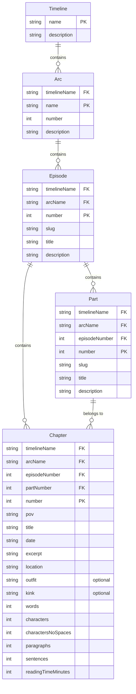

# @echoes-io/models

TypeScript models and validation schemas for **Echoes** - a multi-POV digital storytelling platform.

## Table of Contents

- [Overview](#overview)
- [Architecture Context](#architecture-context)
- [Content Structure](#content-structure)
  - [Hierarchy](#hierarchy)
  - [File Structure Convention](#file-structure-convention)
- [Models](#models)
  - [Core Content Models](#core-content-models)
  - [Metadata Models](#metadata-models)
- [Compatibility with @echoes-io/utils](#compatibility-with-echoes-ioutils)
- [Installation](#installation)
- [Models Reference](#models-reference)
  - [Timeline](#timeline)
  - [Arc](#arc)
  - [Episode](#episode)
  - [Part](#part)
  - [Chapter](#chapter)
  - [ChapterMetadata](#chaptermetadata)
  - [TextStats](#textstats)
- [Usage](#usage)
- [Development](#development)
  - [Tech Stack](#tech-stack)
  - [Scripts](#scripts)
- [Integration](#integration)
  - [With @echoes-io/utils](#with-echoes-ioutils)
  - [With @echoes-io/tracker](#with-echoes-iotracker)
  - [With @echoes-io/rag](#with-echoes-iorag)
- [License](#license)

## Overview

This package provides shared TypeScript interfaces, types, and validation schemas used across the Echoes ecosystem:
- Timeline repositories (content storage)
- Tracker service (content management and API)
- RAG service (semantic search and AI context)
- Web application (frontend)
- CLI tools and utilities

## Architecture Context

Echoes is organized as a multi-repository system:

```
@echoes-io/utils     # Shared utilities (markdown parsing, text stats)
@echoes-io/models    # This package - shared types and schemas
@echoes-io/tracker   # Content management API and database
@echoes-io/rag       # Semantic search and AI context
echoes-timeline-*    # Individual timeline content repositories
echoes-web-app       # Frontend application
```

## Content Structure

Echoes organizes storytelling content in a hierarchical structure:



### Hierarchy

```
Timeline
  └─ Arc (ordered)
      └─ Episode (numbered)
          ├─ Part (numbered, optional subdivision)
          └─ Chapter (numbered, continuous within episode)
```

**Note**: Chapter numbering is continuous within an episode and does NOT reset per part.

### File Structure Convention
```
timeline-repo/
├── content/
│   ├── <arc-name>/
│   │   └── <ep01-episode-title>/
│   │       └── <ep01-ch001-pov-title>.md
```

**Naming Conventions:**
- **Episode numbers**: 2-digit padding (`ep01`, `ep02`, `ep12`)
- **Chapter numbers**: 3-digit padding (`ch001`, `ch005`, `ch123`)
- **Slugification**: lowercase, hyphens, no special characters
- **Example**: `content/introduction-arc/ep01-first-meeting/ep01-ch005-alice-first-meeting.md`

## Models

This package defines TypeScript interfaces for:

### Core Content Models
- `Timeline` - Root story container with name and description
- `Arc` - Story arc within timeline with ordering
- `Episode` - Episode within arc with numbering, slug, title, description
- `Part` - Part within episode with numbering, slug, title, description
- `Chapter` - Individual content file with metadata and stats (content stored in .md files)

### Metadata Models
- `ChapterMetadata` - Frontmatter structure for .md files:
  - **Required fields**: `pov`, `title`, `date`, `timeline`, `arc`, `episode` (number), `part` (number), `chapter` (number), `excerpt`, `location`
  - **Optional fields**: `outfit`, `kink`
- `TextStats` - Text statistics from content analysis:
  - `words`, `characters`, `charactersNoSpaces`, `paragraphs`, `sentences`, `readingTimeMinutes`

## Compatibility with @echoes-io/utils

This package provides the same interfaces as `@echoes-io/utils` but adds:
- **Database-ready models** with IDs and relationships
- **Zod validation schemas** for runtime type checking
- **API request/response types** for the tracker service
- **Extended metadata** for content management

```typescript
// These interfaces match @echoes-io/utils exactly
import type { ChapterMetadata, TextStats } from '@echoes-io/models';

// These are new database models
import type { Timeline, Arc, Episode, Chapter } from '@echoes-io/models';

// These are new validation schemas
import { validateChapterMetadata, validateTimeline } from '@echoes-io/models';
```

## Installation

```bash
npm install @echoes-io/models
```

## Models Reference

### Timeline

Root container for a story universe.

| Field | Type | Key | Description |
|-------|------|-----|-------------|
| `name` | `string` | PK | Timeline name (unique identifier) |
| `description` | `string` | | Timeline description |

**Example:**
```typescript
const timeline: Timeline = {
  name: 'main-story',
  description: 'The primary storyline',
};
```

---

### Arc

Story arc within a timeline. Represents major story phases (e.g., "Introduction", "Rising Action").

| Field | Type | Key | Description |
|-------|------|-----|-------------|
| `timelineName` | `string` | FK, PK | Timeline name (foreign key) |
| `name` | `string` | PK | Arc name |
| `number` | `number` | | Arc order/number within timeline |
| `description` | `string` | | Arc description |

**Primary Key:** `(timelineName, name)`

**Example:**
```typescript
const arc: Arc = {
  timelineName: 'main-story',
  name: 'introduction',
  number: 1,
  description: 'The beginning of the story',
};
```

---

### Episode

Episode within an arc. Represents story events or time periods.

| Field | Type | Key | Description |
|-------|------|-----|-------------|
| `timelineName` | `string` | FK, PK | Timeline name (foreign key) |
| `arcName` | `string` | FK, PK | Arc name (foreign key) |
| `number` | `number` | PK | Episode number (e.g., 1, 2, 3) |
| `slug` | `string` | | Episode slug (URL-friendly) |
| `title` | `string` | | Episode title |
| `description` | `string` | | Episode description |

**Primary Key:** `(timelineName, arcName, number)`

**Example:**
```typescript
const episode: Episode = {
  timelineName: 'main-story',
  arcName: 'introduction',
  number: 1,
  slug: 'first-meeting',
  title: 'First Meeting',
  description: 'Alice and Bob meet for the first time',
};
```

---

### Part

Part within an episode. Used for organizing longer episodes into subdivisions.

| Field | Type | Key | Description |
|-------|------|-----|-------------|
| `timelineName` | `string` | FK, PK | Timeline name (foreign key) |
| `arcName` | `string` | FK, PK | Arc name (foreign key) |
| `episodeNumber` | `number` | FK, PK | Episode number (foreign key) |
| `number` | `number` | PK | Part number within episode |
| `slug` | `string` | | Part slug (URL-friendly) |
| `title` | `string` | | Part title |
| `description` | `string` | | Part description |

**Primary Key:** `(timelineName, arcName, episodeNumber, number)`

**Example:**
```typescript
const part: Part = {
  timelineName: 'main-story',
  arcName: 'introduction',
  episodeNumber: 1,
  number: 1,
  slug: 'morning',
  title: 'Morning',
  description: 'The morning scene',
};
```

---

### Chapter

Individual content file (.md with frontmatter). Contains all metadata and text statistics.

**Note:** Chapter numbering is continuous within an episode and does NOT reset per part.

| Field | Type | Key | Required | Description |
|-------|------|-----|----------|-------------|
| `timelineName` | `string` | FK, PK | ✓ | Timeline name (foreign key) |
| `arcName` | `string` | FK, PK | ✓ | Arc name (foreign key) |
| `episodeNumber` | `number` | FK, PK | ✓ | Episode number (foreign key) |
| `partNumber` | `number` | FK | ✓ | Part number (indicates which part the chapter belongs to) |
| `number` | `number` | PK | ✓ | Chapter number (unique within episode) |
| **Metadata** | | | | |
| `pov` | `string` | | ✓ | Point of view character |
| `title` | `string` | | ✓ | Chapter title |
| `date` | `Date` | | ✓ | Chapter date |
| `excerpt` | `string` | | ✓ | Brief chapter description |
| `location` | `string` | | ✓ | Chapter location/setting |
| `outfit` | `string` | | | Character outfit description (optional) |
| `kink` | `string` | | | Content tags/kinks (optional) |
| **Text Statistics** | | | | |
| `words` | `number` | | ✓ | Total word count |
| `characters` | `number` | | ✓ | Total character count (including spaces) |
| `charactersNoSpaces` | `number` | | ✓ | Character count excluding spaces |
| `paragraphs` | `number` | | ✓ | Number of paragraphs |
| `sentences` | `number` | | ✓ | Number of sentences |
| `readingTimeMinutes` | `number` | | ✓ | Estimated reading time in minutes (200 words/min) |

**Primary Key:** `(timelineName, arcName, episodeNumber, number)`

**Example:**
```typescript
const chapter: Chapter = {
  timelineName: 'main-story',
  arcName: 'introduction',
  episodeNumber: 1,
  partNumber: 1,
  number: 1,
  pov: 'Alice',
  title: 'First Meeting',
  date: new Date('2025-01-01'),
  excerpt: 'Alice meets Bob at the coffee shop',
  location: 'Coffee Shop',
  outfit: 'Blue dress', // optional
  kink: 'romance', // optional
  words: 1000,
  characters: 5000,
  charactersNoSpaces: 4000,
  paragraphs: 10,
  sentences: 50,
  readingTimeMinutes: 5,
};
```

---

### ChapterMetadata

Frontmatter structure for .md files. This is the source of truth that gets replicated into the database.

| Field | Type | Required | Description |
|-------|------|----------|-------------|
| `pov` | `string` | ✓ | Point of view character |
| `title` | `string` | ✓ | Chapter title |
| `date` | `string \| Date` | ✓ | Chapter date (accepts both string and Date, converts to Date) |
| `timeline` | `string` | ✓ | Timeline name |
| `arc` | `string` | ✓ | Arc name |
| `episode` | `number` | ✓ | Episode number |
| `part` | `number` | ✓ | Part number |
| `chapter` | `number` | ✓ | Chapter number |
| `excerpt` | `string` | ✓ | Brief chapter description |
| `location` | `string` | ✓ | Chapter location/setting |
| `outfit` | `string` | | Character outfit description (optional) |
| `kink` | `string` | | Content tags/kinks (optional) |

**Example:**
```typescript
const metadata: ChapterMetadata = {
  pov: 'Alice',
  title: 'First Meeting',
  date: '2025-01-01',
  timeline: 'main-story',
  arc: 'introduction',
  episode: 1,
  part: 1,
  chapter: 1,
  excerpt: 'Alice meets Bob at the coffee shop',
  location: 'Coffee Shop',
};
```

---

### TextStats

Text statistics calculated from content analysis (via `@echoes-io/utils`).

| Field | Type | Description |
|-------|------|-------------|
| `words` | `number` | Total word count |
| `characters` | `number` | Total character count (including spaces) |
| `charactersNoSpaces` | `number` | Character count excluding spaces |
| `paragraphs` | `number` | Number of paragraphs |
| `sentences` | `number` | Number of sentences |
| `readingTimeMinutes` | `number` | Estimated reading time in minutes (200 words/min) |

**Example:**
```typescript
const stats: TextStats = {
  words: 1000,
  characters: 5000,
  charactersNoSpaces: 4000,
  paragraphs: 10,
  sentences: 50,
  readingTimeMinutes: 5,
};
```

---

## Usage

```typescript
import { 
  Timeline, 
  Arc, 
  Episode, 
  Part, 
  Chapter, 
  ChapterMetadata,
  validateTimeline,
  validateChapter,
} from '@echoes-io/models';

// Type-safe content structures
const timeline: Timeline = {
  name: 'main-story',
  description: 'The primary storyline',
};

const arc: Arc = {
  timelineName: 'main-story',
  name: 'introduction',
  number: 1,
  description: 'The beginning of the story',
};

const episode: Episode = {
  timelineName: 'main-story',
  arcName: 'introduction',
  number: 1,
  slug: 'first-meeting',
  title: 'First Meeting',
  description: 'Alice and Bob meet for the first time',
};

const part: Part = {
  timelineName: 'main-story',
  arcName: 'introduction',
  episodeNumber: 1,
  number: 1,
  slug: 'morning',
  title: 'Morning',
  description: 'The morning scene',
};

const chapter: Chapter = {
  timelineName: 'main-story',
  arcName: 'introduction',
  episodeNumber: 1,
  partNumber: 1,
  number: 1,
  pov: 'Alice',
  title: 'First Meeting',
  date: new Date('2025-01-01'),
  excerpt: 'Alice meets Bob at the coffee shop',
  location: 'Coffee Shop',
  words: 1000,
  characters: 5000,
  charactersNoSpaces: 4000,
  paragraphs: 10,
  sentences: 50,
  readingTimeMinutes: 5,
};

// Validation with Zod
try {
  validateTimeline(timeline);
  validateChapter(chapter);
  console.log('Valid!');
} catch (error) {
  console.error('Validation error:', error);
}
```

## Development

### Tech Stack
- **Language**: TypeScript (strict mode)
- **Validation**: Zod (planned)
- **Testing**: Vitest
- **Linting**: Biome

### Scripts
```bash
# Run tests
npm test

# Type checking
npm run type-check

# Lint code
npm run lint
```

## Integration

### With @echoes-io/utils
- Uses `ChapterMetadata` interface from this package
- Provides validation for parsed frontmatter

### With @echoes-io/tracker
- Implements these models in database schema
- Uses types for API endpoints and operations

### With @echoes-io/rag
- Uses models for content indexing
- Provides types for semantic search results

## License

MIT
